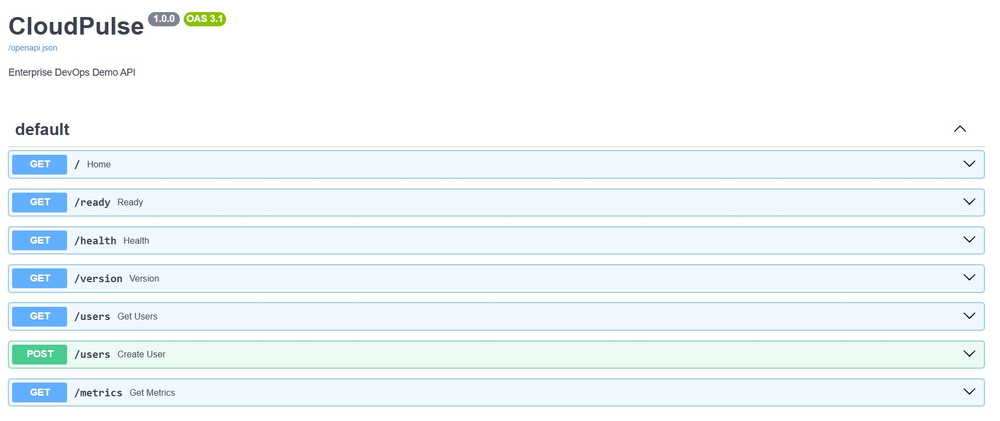
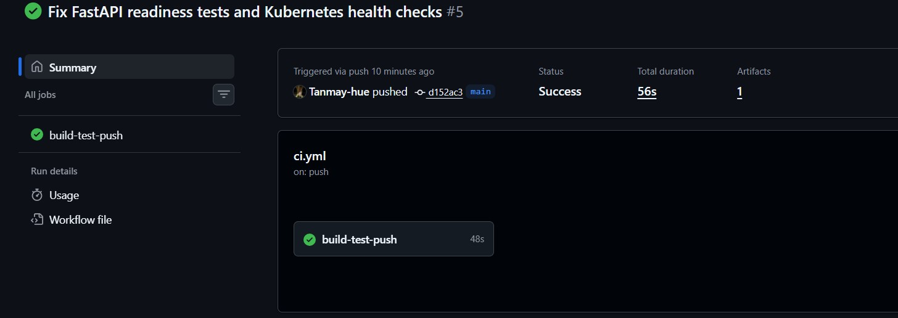
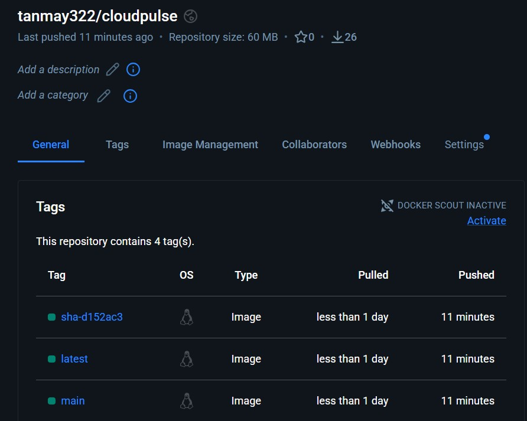
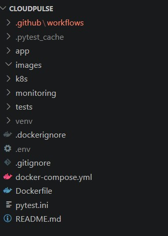

# 🚀 CloudPulse

<p align="center">


</p>

## 📖 Project Overview

CloudPulse is an **end-to-end DevOps project** built to demonstrate modern software delivery practices using **FastAPI, Docker, GitHub Actions, Kubernetes, Prometheus, and Grafana**.

The project showcases how an application moves from development to deployment with automated testing, containerization, continuous integration, Kubernetes deployment configuration, and monitoring.

It is designed as a portfolio project for aspiring **DevOps and Cloud Engineers**.

---

# ✨ Features

- REST API built with FastAPI
- Dockerized application
- Automated CI/CD with GitHub Actions
- Automated unit testing using Pytest
- Docker Hub image publishing
- Kubernetes Deployment
- Kubernetes Service
- Kubernetes Namespace
- ConfigMap & Secret
- Horizontal Pod Autoscaler (HPA)
- Ingress Configuration
- Resource Requests & Limits
- Readiness & Liveness Probes
- Graceful Startup & Shutdown
- Prometheus Metrics Endpoint
- Grafana Dashboard Configuration
- Structured Logging

---

# 🏗 Architecture

```text
                    Developer
                         │
                         ▼
                  GitHub Repository
                         │
                         ▼
                 GitHub Actions CI/CD
                         │
       ┌─────────────────┴─────────────────┐
       ▼                                   ▼
 Run Automated Tests              Build Docker Image
       │                                   │
       └─────────────────┬─────────────────┘
                         ▼
                Push Image to Docker Hub
                         │
                         ▼
                Kubernetes Deployment
                         │
          ┌──────────────┴──────────────┐
          ▼                             ▼
     ConfigMap                     Secret
          │                             │
          └──────────────┬──────────────┘
                         ▼
                 CloudPulse Pods
                         │
                         ▼
                   Kubernetes Service
                         │
                         ▼
                       Ingress
                         │
                         ▼
                    Prometheus
                         │
                         ▼
                      Grafana
```

---

# 🛠 Tech Stack

| Category | Technology |
|----------|------------|
| Language | Python 3.13 |
| Framework | FastAPI |
| Testing | Pytest |
| Containerization | Docker |
| CI/CD | GitHub Actions |
| Registry | Docker Hub |
| Orchestration | Kubernetes |
| Monitoring | Prometheus |
| Visualization | Grafana |
| Version Control | Git & GitHub |

---

# 📂 Project Structure

```text
CloudPulse/
│
├── app/
│   ├── main.py
│   ├── config.py
│   ├── logger.py
│   ├── metrics.py
│   ├── models.py
│   ├── database.py
│   └── requirements.txt
│
├── tests/
│   └── test_api.py
│
├── k8s/
│   ├── namespace.yaml
│   ├── deployment.yaml
│   ├── service.yaml
│   ├── ingress.yaml
│   ├── configmap.yaml
│   ├── secret.yaml
│   ├── hpa.yaml
│   ├── prometheus-configmap.yaml
│   ├── prometheus-deployment.yaml
│   ├── prometheus-service.yaml
│   ├── grafana-deployment.yaml
│   └── grafana-service.yaml
│
├── monitoring/
│   ├── prometheus.yml
│   └── grafana/
│       ├── datasource.yml
│       └── dashboard.json
│
├── images/
│
├── tests/
│
├── .github/
│   └── workflows/
│       └── ci.yml
│
├── Dockerfile
├── docker-compose.yml
├── pytest.ini
└── README.md
```

---

# 🔄 CI/CD Workflow

```text
Code Push
     │
     ▼
GitHub Actions
     │
     ├── Checkout Repository
     ├── Setup Python
     ├── Install Dependencies
     ├── Run Pytest
     ├── Login to Docker Hub
     ├── Build Docker Image
     └── Push Image to Docker Hub
```

---

# ☸ Kubernetes Architecture

```text
                Ingress
                    │
                    ▼
             Service (ClusterIP)
                    │
                    ▼
               Deployment
                    │
          ┌─────────┴─────────┐
          ▼                   ▼
       Pod-1               Pod-2
          │                   │
          └─────────┬─────────┘
                    ▼
          ConfigMap + Secret
```

---

# 📊 Monitoring

CloudPulse exposes application metrics through the `/metrics` endpoint.

### Monitoring Stack

- Prometheus
- Grafana

### Health Endpoints

| Endpoint | Purpose |
|----------|----------|
| `/health` | Liveness Check |
| `/ready` | Readiness Check |
| `/metrics` | Prometheus Metrics |

---

# 📌 API Endpoints

| Method | Endpoint | Description |
|---------|----------|-------------|
| GET | `/` | Home |
| GET | `/health` | Health Check |
| GET | `/ready` | Readiness Check |
| GET | `/version` | Application Version |
| GET | `/users` | Get Users |
| POST | `/users` | Create User |
| GET | `/metrics` | Prometheus Metrics |

---

# ▶ Running Locally

## Clone Repository

```bash
git clone https://github.com/Tanmay-hue/CloudPulse.git
cd CloudPulse
```

---

## Create Virtual Environment

Windows

```bash
python -m venv .venv
.venv\Scripts\activate
```

Linux/macOS

```bash
python3 -m venv .venv
source .venv/bin/activate
```

---

## Install Dependencies

```bash
pip install -r app/requirements.txt
```

---

## Start Application

```bash
uvicorn app.main:app --reload
```

---

## Swagger Documentation

```
http://127.0.0.1:8000/docs
```

---

## Run Tests

```bash
pytest
```

---

# 🐳 Docker

Build Image

```bash
docker build -t cloudpulse .
```

Run Container

```bash
docker run -p 8000:8000 cloudpulse
```

---

# 📸 Screenshots

## Swagger UI



---

## GitHub Actions (Successful CI/CD)



---

## Docker Hub Repository



---

## Project Structure



---

# 🚀 Future Improvements

- Deploy on AWS EKS
- Infrastructure as Code with Terraform

---

# 🎯 Learning Outcomes

This project demonstrates practical experience with:

- REST API Development
- Docker Containerization
- CI/CD Pipeline Automation
- GitHub Actions
- Docker Hub Integration
- Kubernetes Resource Management
- Health & Readiness Probes
- Prometheus Monitoring
- Grafana Configuration
- Production-style DevOps Workflow

---

# 👨‍💻 Author

**Tanmay Singh**

GitHub: https://github.com/Tanmay-hue
